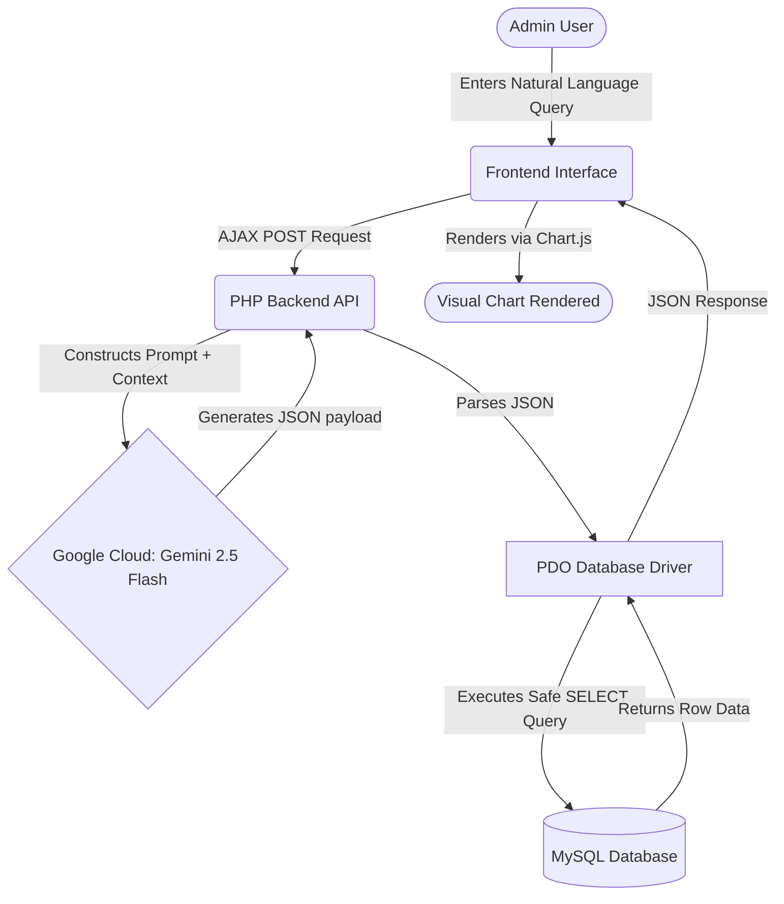
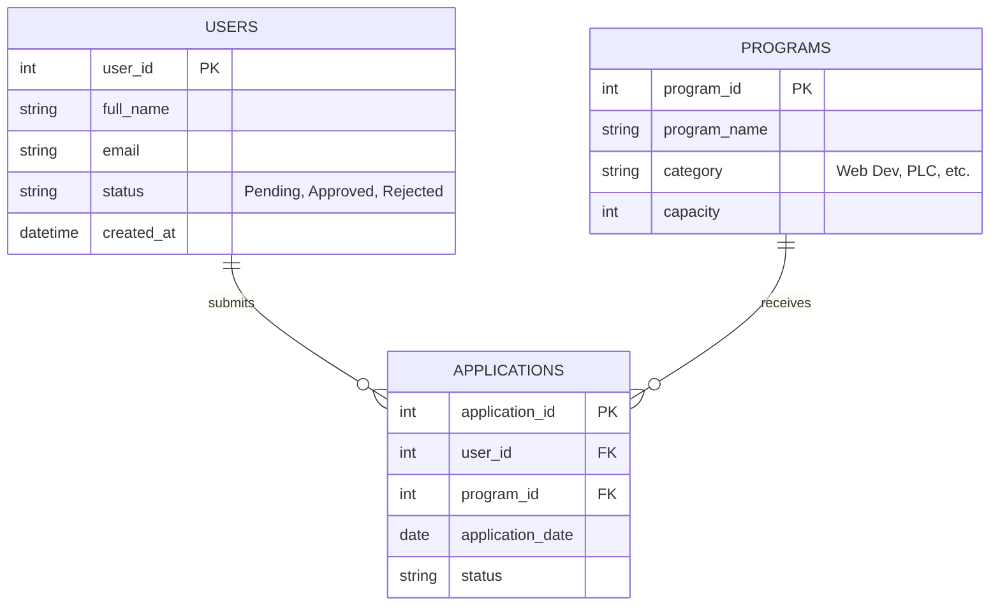

# Full System & Training Documentation Report
**Selangor Technical Skills Development Centre (STDC)**
*IT and Software Development Department*

---

## CHAPTER 1: INTRODUCTION

### 1.1 Background of Industrial Training
Industrial training is a crucial component of the academic curriculum, designed to bridge the gap between theoretical knowledge and practical industry applications. It exposes students to real-world software development environments, fostering technical proficiency, teamwork, and professional problem-solving skills. Through this training, students gain firsthand experience in project lifecycles, adapting to modern frameworks, and meeting client-driven deliverables.

### 1.2 Background of Organization
The organization attached is the **Selangor Technical Skills Development Centre (STDC)**, an esteemed institution dedicated to providing technical and vocational education and training (TVET). STDC aims to produce highly skilled professionals tailored to the demands of the modern workforce. The institution manages various high-impact programs, including the STDC-Siemens PLC Certification and Full Stack Web Development Bootcamps, requiring robust digital infrastructure to handle continuous student enrollments.

### 1.3 Background of Department Attached
The attachment was within the **IT and Software Development Department** of STDC. This department is responsible for digitizing campus operations, managing data architecture, and developing internal platforms like **BASE_URL**. The team focuses on modernizing legacy systems, implementing artificial intelligence solutions for data analytics, and ensuring secure, seamless registration workflows for both administrators and applicants.

---

## CHAPTER 2: SYSTEM ARCHITECTURE AND DESIGN

To build the `BASE_URL` platform and the AI-Powered SQL Dashboard, extensive system analysis and design were required to ensure seamless communication between the user interface, the machine learning models, and the database architecture.

### 2.1 Directory Structure and Core Files
The application is built using a monolithic PHP architecture, structured into logical feature-based directories.

- **`/admin`**: Contains all administrative functionalities (Dashboard, AI Query Interface, Program creation).
- **`/auth`**: Handles session management, standard authentication, and Google OAuth Single Sign-On (SSO).
- **`/user`**: The applicant portal for users to register, manage profiles, and apply for STDC programs.
- **`/config` & `/includes`**: Configuration files (Database PDO connection, Google API Client IDs) and reusable UI components.
- **`setup.sql`**: The primary SQL file containing the Data Definition Language (DDL) schema for the entire application.

### 2.2 System Architecture Flowchart
The following flowchart illustrates the complete documentation flow for the development of the AI-powered website interface. It outlines how natural language queries are processed via Google Cloud's infrastructure to generate visual charts.

### 2.3 Entity-Relationship Diagram (ERD)
The AI assistant relies on a deep understanding of the relational database schema. Below is the simplified Entity-Relationship Diagram (ERD) that represents the core tables managed within the **BASE_URL** platform.

---

## CHAPTER 3: ASSIGNMENTS AND IMPLEMENTATION

### 3.1 Task 1: Development of an AI-Powered SQL Dashboard (Text-to-SQL)

#### 3.1.1 Introduction
The primary task involved building an AI Dashboard Assistant capable of translating natural language queries into complex MySQL statements. This allows administrators to request data (e.g., "Show me all pending users") without requiring programming knowledge.

#### 3.1.2 Google Cloud Integration
The core engine driving this feature relies on **Google Cloud's Gemini 2.5 Flash API**, designed for high-speed, cost-effective multimodal reasoning. The system also implements a robust fallback mechanism to `Gemini 2.0 Flash` and `Gemini 1.5 Flash` to ensure maximum uptime.
- **API Setup:** The system connects securely via cURL requests authenticated by Google Cloud Service Accounts/API Keys (`application_default_credentials.json`). 
- **Endpoint Management:** All communications between the PHP backend and the Google Cloud servers are encrypted to ensure data privacy. The cloud architecture was chosen for its low latency and superior natural language understanding.

#### 3.1.3 Machine Learning Model Development & Prompt Engineering
Instead of training a model from scratch, we utilized **Zero-Shot Prompting** and **Context Injection** techniques on the pre-trained Gemini 2.5 Flash LLM.
- **Schema Injection:** A strict prompt schema was engineered to feed the database structure (programs, users, applications) to the LLM upon every request.
- **Output Constraints:** The AI was strictly constrained through system instructions to output purely JSON formats containing safe `SELECT` SQL queries.
- **Temperature Settings:** The model's temperature parameter was set extremely low (near 0.0) to ensure deterministic, highly accurate SQL generation rather than creative text.

#### 3.1.4 Implementation & Security
The backend was written in PHP. Once the JSON payload containing the SQL query is received from Gemini:
1. The PHP backend decodes the JSON.
2. It safely executes the `SELECT` query using PDO (PHP Data Objects).
3. Robust `try-catch` blocks gracefully handle any SQL errors to prevent fatal crashes.

#### 3.1.5 Results and Discussion
The integration successfully allowed admins to query data naturally. A challenge encountered was LLM hallucinations requesting non-existent columns. This was resolved by refining the prompt engineering constraints and enforcing strict schema validation.

### 3.2 Task 2: Dynamic Data Visualization with Chart.js

#### 3.2.1 Introduction
Raw SQL data is difficult to interpret at a glance. Task 2 focused on transforming the AI-generated JSON data into interactive, visual charts (Bar, Pie, Line, Stacked) directly within the chat interface.

#### 3.2.2 Implementation
Chart.js was integrated into the frontend. When the AI returns a payload specifying `type: "pie"` or `type: "bar"`, the JavaScript dynamically generates a `<canvas>` element. Algorithms were written to automatically map database columns to X/Y axes and group data correctly. A feature was also developed to render multiple charts simultaneously in a grid layout.

#### 3.2.3 Results and Discussion
The data visualizations drastically improved the administrative user experience. Adjustments were required to handle long X-axis labels, resulting in the implementation of custom label truncation logic within the Chart.js configuration.

### 3.3 Task 3: Glassmorphism UI and Advanced Export Module

#### 3.3.1 Introduction
To ensure the platform felt premium, the interface was redesigned using modern glassmorphism aesthetics. Furthermore, an export module was required so admins could download charts for presentations.

#### 3.3.2 Implementation
The CSS was overhauled to include backdrop-filters and smooth gradients. For exporting, a "Three Vertical Dots" native select menu was implemented to bypass CSS clipping issues. A dynamic Export Preview Modal was built, allowing users to define custom high-resolution dimensions (e.g., 1920x1080) before utilizing the `jsPDF` and Canvas API to generate final PNG or PDF documents.

#### 3.3.3 Results and Discussion
The Export Modal solved a critical issue where legends were being cut off on smaller screens, allowing admins to dynamically resize their charts off-screen to perfectly fit presentation formats before downloading.

---

## CHAPTER 4: CLOUD DEPLOYMENT AND INFRASTRUCTURE

### 4.1 Introduction to Cloud Migration
As part of the industrial training and in alignment with self-directed learning for the **Google Cloud Associate Cloud Engineer** certification, the final phase of the project involved migrating the `BASE_URL` application from a local development environment (XAMPP) to a production-grade cloud infrastructure. This provided hands-on experience with Infrastructure as a Service (IaaS) deployments.

### 4.2 Compute Engine Virtual Machine (VM) Setup
The deployment utilized **Google Compute Engine (GCE)**. 
- **Provisioning:** A Linux Virtual Machine (Debian/Ubuntu) was provisioned to host the application.
- **Networking:** Firewall rules were configured within the Virtual Private Cloud (VPC) network to allow HTTP (port 80) and HTTPS (port 443) traffic, ensuring the web application could be accessed publicly.
- **External IP:** A static External IP address was reserved and attached to the VM instance to guarantee a persistent access point for STDC administrators and students.

### 4.3 Database Installation and Migration
To practice core system administration and database management skills, the database was manually installed within the VM.
- **MySQL Installation:** MySQL server was installed and configured directly on the Linux VM.
- **Data Migration:** The local `stdc_registration_staging` database (managed via XAMPP) was exported as an SQL dump. This dump was securely transferred to the VM via SSH/SCP and imported into the production MySQL instance.

### 4.4 Application Deployment and Access
- **Web Server Setup:** An Apache web server and PHP were installed and configured on the VM.
- **File Transfer:** The application source code (PHP scripts, frontend assets, and Google API credentials) was migrated from the local environment to the web server directory.
- **Live Access:** Following successful configuration, the platform became globally accessible via the assigned External IP. This cloud migration successfully demonstrated the practical application of Google Cloud engineering principles, resulting in a highly available, scalable registration portal.

---

## CHAPTER 5: CONCLUSION AND RECOMMENDATIONS

### 5.1 Benefit of the Assignments
The tasks completed have transformed the **BASE_URL** platform from a basic registration system into a highly intelligent, cloud-hosted data analysis tool. The integration of the AI Dashboard significantly reduces the administrative burden of generating manual reports. By allowing non-technical staff to query complex datasets using everyday language, data accessibility within the organization has been vastly improved, empowering faster decision-making.

### 5.2 Summary of Industrial Training
The industrial training period provided invaluable exposure to full-stack web development, machine learning application, and cloud computing infrastructure. It fostered a deep understanding of translating complex business requirements into user-friendly software solutions. Technical skills in PHP, vanilla JavaScript, advanced CSS, LLM prompt engineering, and **Google Cloud Platform (GCP) deployment** were significantly enhanced. Beyond technical growth, the experience cultivated strong analytical thinking and the ability to independently architect features from concept to production, serving as a solid foundation for achieving the Google Cloud Associate Cloud Engineer certification.
